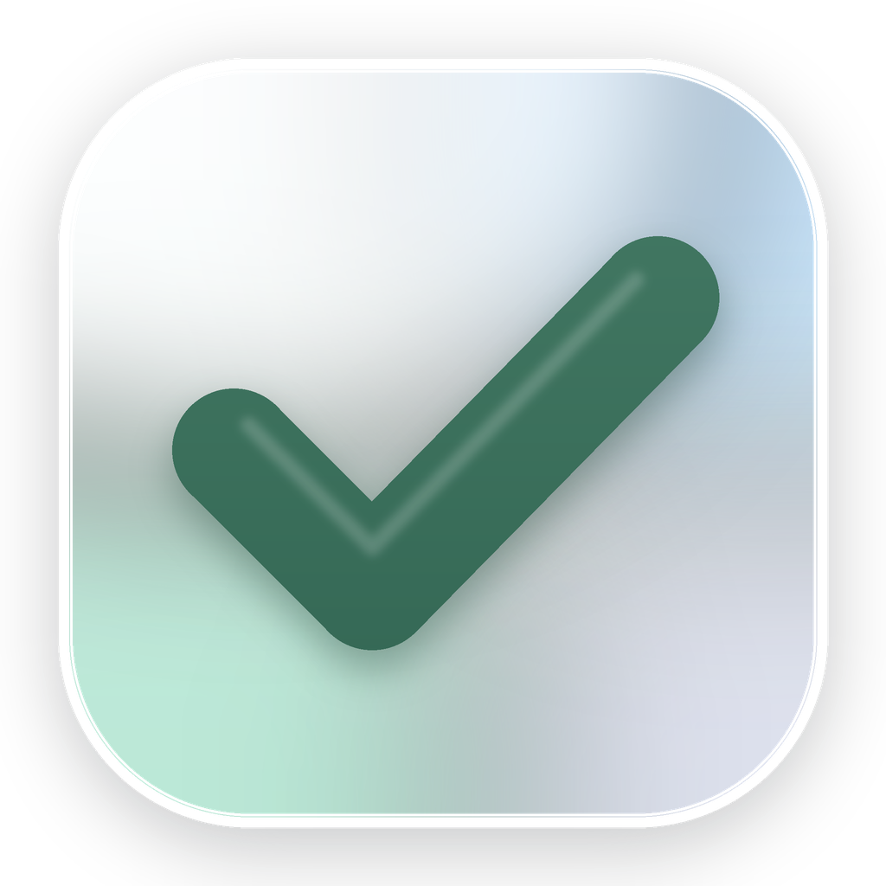
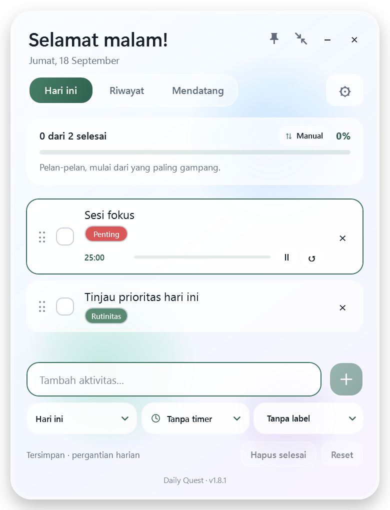

<p align="center">
  
</p>

<h1 align="center">Daily Quest</h1>

<p align="center">
  A lightweight, local-first daily checklist widget for Windows, wrapped in a minimal liquid-glass interface.
</p>

<p align="center">
  <strong>English</strong> · <a href="README.id.md">Bahasa Indonesia</a>
</p>

<p align="center">
  <a href="https://github.com/samuelraindrwn/daily-quest/releases/latest"></a>
  
  
</p>

Daily Quest keeps today's priorities visible without turning them into a complicated project-management system. It combines quick check-ins, automatic local saving, progress tracking, and expandable daily history in a compact desktop widget.

<p align="center">
  
</p>

## Highlights

- Starts with an empty checklist—your routine stays yours.
- Add, complete, and remove activities in a few clicks.
- See today's greeting, completion count, percentage, and progress bar at a glance.
- Automatically archive each day's progress and start the next day with a reusable unchecked list.
- Review previous days in History; select a date card to reveal its activity details.
- Preserve completed entries in history after clearing them from today's active list.
- Switch the interface between English and Indonesian.
- Pin the widget above other windows, minimize it, or move and resize it freely.
- Open at the top-right of the primary work area with a comfortable edge gap, while restoring the saved size, language, and pin preference.
- Run a single instance entirely offline, with no account, telemetry, or network connection required.

## Download and install

1. Open the [latest release](https://github.com/samuelraindrwn/daily-quest/releases/latest).
2. Download the `win-x64.zip` asset (recommended) and extract it, or download the standalone `.exe` asset.
3. Run `DailyQuest.exe`.

The release is portable and self-contained for 64-bit Windows 10/11, so there is no installer and the .NET runtime does not need to be installed separately. To update, close Daily Quest and replace the old executable; your data in Local AppData remains intact.

> [!NOTE]
> The current executable is not code-signed, so Windows may show a SmartScreen warning. Continue only when the file came from this repository's official Releases page. You can verify it with the included `SHA256SUMS.txt`.

## How to use it

| Control | Action |
| --- | --- |
| Activity field | Type a new activity. Press `Enter` or select `+` to add it. |
| Checkbox | Mark an activity as complete or incomplete. |
| `×` beside an activity | Remove that activity from the active checklist. |
| **Clear done** | Remove completed activities from the active list while keeping their completed history. |
| **Reset** | Uncheck every activity for today. |
| **Today** | Return to the active checklist. |
| **History** | View daily completion summaries. Select a card to expand its details. |
| **ID / EN** | Switch the application language. |
| Pin button | Toggle always-on-top mode. |
| Header and window edges | Drag the header to move the widget, or drag an edge to resize it. |

When the date changes, Daily Quest archives the previous day, keeps the activity list, and resets its checkboxes for the new day.

### Keyboard navigation

| Key | Action |
| --- | --- |
| `Enter` | Add the current activity while the input is focused. |
| `Esc` | Clear the current input without adding it. |
| `Tab` / `Shift+Tab` | Move focus forward or backward. |
| `Space` | Activate the focused checkbox or button. |

Daily Quest does not register global keyboard shortcuts.

## Data and privacy

All data stays on the device in:

```text
%LOCALAPPDATA%\DailyQuest\state.json
```

The state file contains activity text, daily history, language, always-on-top preference, and window size. Daily Quest does not require an account and does not upload this data anywhere.

For a manual backup, close the app and copy the `%LOCALAPPDATA%\DailyQuest` folder. To start over without immediately deleting data, close the app and rename that folder; a clean one will be created on the next launch.

If a state file cannot be read, Daily Quest keeps a timestamped `state.json.broken-*` copy before starting with a clean state.

### Upgrading from Morning Check-in

If `%LOCALAPPDATA%\DailyQuest\state.json` does not exist, Daily Quest validates and copies the former `%LOCALAPPDATA%\MorningCheckIn\state.json` file to the new location. The original legacy file remains untouched as a rollback copy. If both files already exist, the Daily Quest state takes priority.

## Build from source

Requirements:

- Windows 10 or Windows 11
- [.NET 10 SDK](https://dotnet.microsoft.com/download/dotnet/10.0)
- Git

```powershell
git clone https://github.com/samuelraindrwn/daily-quest.git
cd daily-quest
dotnet restore .\DailyQuest.csproj
dotnet build .\DailyQuest.csproj -c Release
dotnet run --project .\DailyQuest.csproj
```

## Run the tests

```powershell
dotnet run --project .\tests\DailyQuest.LogicTests\DailyQuest.LogicTests.csproj -c Release
```

The dependency-free test harness covers checklist mutations, date rollover, history retention, language settings, JSON persistence, corrupt-state recovery, and legacy-state migration.

## Create a portable build

```powershell
dotnet publish .\DailyQuest.csproj `
  -c Release `
  -r win-x64 `
  --self-contained true `
  -p:PublishSingleFile=true `
  -p:IncludeNativeLibrariesForSelfExtract=true `
  -o .\artifacts\DailyQuest-win-x64
```

The resulting portable application is written to `artifacts\DailyQuest-win-x64\DailyQuest.exe`.

## Project structure

```text
Assets/          App icons and logo
Infrastructure/ Command helpers
Localization/   English and Indonesian UI copy
Models/          Persisted checklist and history data
Services/        JSON state storage and migration
ViewModels/      Checklist, progress, language, and history logic
tests/           Dependency-free logic test runner
```

## Troubleshooting

- **Windows shows “unknown publisher”:** the app is not code-signed yet. Use only the official release and verify its SHA-256 checksum.
- **Opening the app again does not create another window:** Daily Quest allows one instance and restores the existing window instead.
- **The source project reports a missing SDK:** install the .NET 10 SDK, then confirm it appears in `dotnet --list-sdks`.
- **The app starts with a clean state unexpectedly:** check the data folder for a `state.json.broken-*` backup created from unreadable JSON.
- **Legacy migration fails:** the old Morning Check-in state remains untouched, and the failed copy is retained as `state.json.migration-broken-*` in the Daily Quest data folder.

## Contributing

Bug reports and focused pull requests are welcome. Please [open an issue](https://github.com/samuelraindrwn/daily-quest/issues) with clear reproduction steps for bugs, and run the test command above before submitting code changes.
